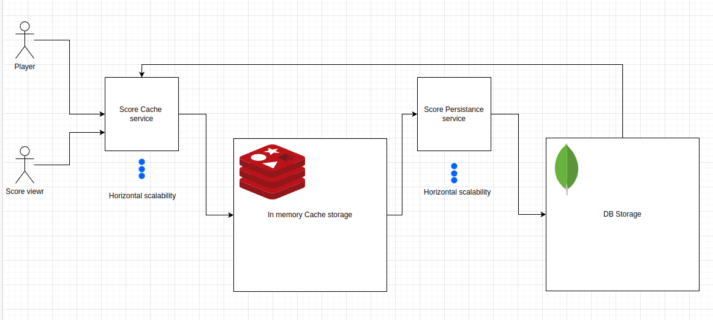

# High availability  player score storage #

## Introduction

For high availability storage architecture we have to provide a reliable and secure solution for storing critical data.
With redundant hardware and software components, disaster recovery strategies, and advanced data protection, 
this architecture ensures that business processes can continue uninterrupted even in the event of system failures. 
This multi-layered approach gives peace of mind that sensitive information is always accessible and secure.

## Architecture
In the diagram above, a simple architecture that achieve this goal, it's composed by: 
- #### Score cache service: 
    This service is a nodeJs service that implement a GraphQl server, and ensure that Score Players requests are 
sorted as reliable as possible. it's accept graphQl mutation requests and store a temporary  data to a Redis cache server.
- ### In memory Cache storage:
    A Redis in memory service for temporary storage
- ### Score persistence service:
    This Service should bulk query the redis server, then bulk save the indexed sore in a mongoDb
- ### DB Storage:
    A MongoDb server

## How it's work
The Idea is to implement a funnel data pipeline to minimize stress on MongoDB during periods of high demand, the MongoDb 
could failure on high demand of write request, so instead writing on the DB on each request, the *cache service* will store 
the data in a memory storage *Redis*, then another service *Score persistence service* will take care on persisting 
the indexed data with bulk operations :

`
await scores.bulkWrite(dataOperations);
`

This way it will be possible to scale the *cache service* or the  *Score persistence service* as well to be able 
to process more requests

## Motivation
The idea here is to minimize the stress on the MongoDB, that is the critical service, by applying the 
Single Responsibility Principle (SRP), si the *cache service* will be in charge on only indexing data and the *persistence service*
will be in charge opf persisting the data, the mongoDb could be scaled by adding more cluster and this is the case 
for each component of this architecture as well. the in memory storage and the persistence service idea is coming from 
already established architecture with message queue management system like KAFKA, or rabbitmq, that can manage this kind 
of problem in more standardized and robust way, 

## Challenges and Pitfalls
After testing this patent it seems that the mongoDb is crashing any way, it doesn't respond after a couple of hours, 
seems that it's a memory overflow issue, that's said, the service persistence need to be more optimised, my first attempt
is to delay more the persistence operation to 5s instead of 2s, I'm pretty sure that the amount of data is not the issue, 
but the 2 seconds saving operation is may be too much.

Also, a usage of a message queue will be a game changing in our case
The service that is queried by the ReactJS FE to display the score board, shouldn't be implemented in the cache service,
for practical reason for this test, (to not implement another service that could take me more time..), but it's also 
something that we could optimize in independent service.

On the contrary, the fact that MongoDB is down results in data loss, as the routine that saves data, purges the fetched data to persist in the Redis index. To prevent this, an enhancement that could be made is to ensure that flushing the Redis index is only performed if the MongoDB saving process has been successful.

## Usage
To make it work just need to perform this command : `make deploy` all services are Dockerized and a docker network will be 
created to manage communication between services
To see the system in action : 
- Execute the python script that simulate a 20 user game play that sending score update each 90ms `python3 randomScore.py `
- Got to the *scoreMonitoringApp* that contain a reactJs app that query the service for updated score
  - `# cd scoreMonitoringApp/score-board/`
  - `# npm install`
  - `# npm run start`
 

  
  
## Requirements
- linux system
- python3 installed
- docker compose capability
- node 16.10

## PS : 
I start working in TypeScript, but I end up to neglect it, It's take me more that 10h of work instead of couple of hours, 
the coding process in his own take me no more the 3 hour, but put things together, dockerized components, documentation 
on how Redis, mongoDb work, I was also challenged about implementing mutation in GraphQl, and gad some trouble with *express-graphql*
and the *graphql* node components. and I was needing some documentations lecture to be able to implement it. 

